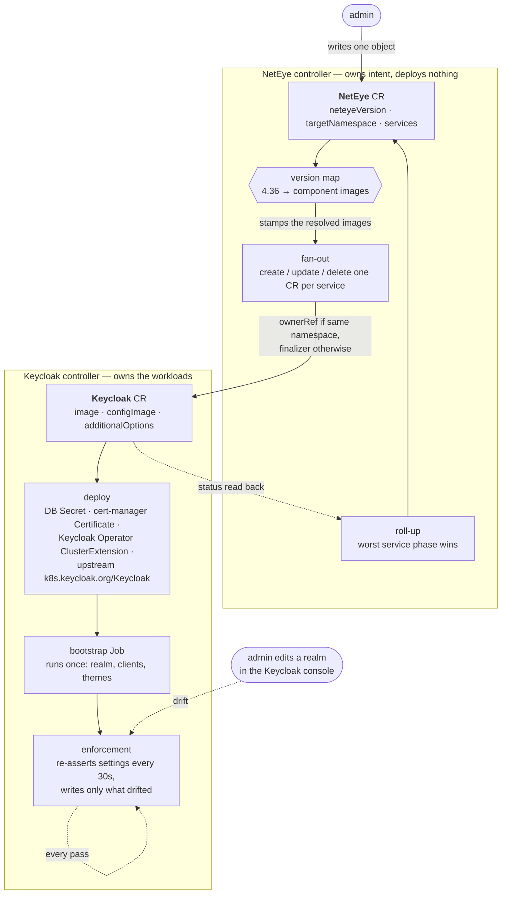
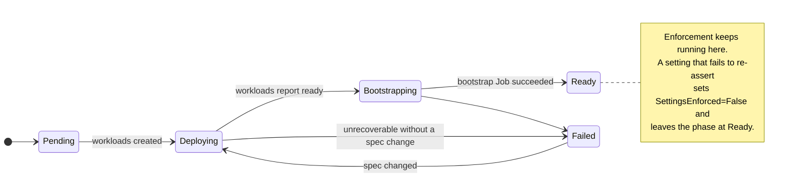

# neteye-operator

Kubernetes operator that deploys and keeps a NetEye installation in the state it
declares.

## Description

An admin writes exactly one object, a `NetEye`: which NetEye product version to
run, which namespace to run it in, and which managed services the installation
is composed of. The operator resolves that product version into the component
container images it is made of — the admin never names an image tag — and fans
the `NetEye` out into one CR per managed service, each reconciled by its own
controller.



Two decisions shape everything else:

**One CR per managed service.** A service that can fail on its own gets a status
an admin can read on its own: `kubectl get keycloaks.neteye.com`. The `NetEye`
status rolls those up — it reads `Ready` only when every service does — but the
service CR remains the authority.

**Bootstrap runs once, enforcement runs forever.** The one-shot Job configures a
fresh instance; drift caused from outside Kubernetes (someone editing a realm in
Keycloak's own admin console) is corrected by the operator on every pass. A Job
is structurally incapable of the second job. Enforcement writes only the fields
that actually drifted, so it never clobbers settings the operator does not own.

Failure is reported along two axes that do not collapse into one:
`status.phase` answers "is it up?", while `status.conditions` report what can
degrade independently. A setting that failed to re-assert is a degraded
instance, not a failed deploy, and deliberately does not move `phase` out of
`Ready`.



### Status

The API, the fan-out, the Keycloak deployment stages and settings enforcement
are implemented. Two things are still stand-ins: the database is an external
PostgreSQL the operator does not provision (`TODO(db)` in
`internal/keycloak/resources.go`), and the component images resolve to a
development registry (`TODO` in `api/v1alpha1/components.go`).

Bootstrap is keyed to its inputs, not to the Job: `status.bootstrapConfigHash`
records the run that succeeded, so an instance stays `Ready` — and stays
enforced — after the Job is garbage-collected, and re-bootstraps only when an
input actually changes.

## Getting Started

### Prerequisites
- cert-manager installed in the cluster: the operator requests the certificate
  each Keycloak instance serves on rather than issuing it, so that renewal is
  cert-manager's problem and not a hand-rolled one.
- OLM v1, through which the upstream Keycloak Operator is installed.
- go version v1.24.0+
- docker version 17.03+.
- kubectl version v1.11.3+.
- Access to a Kubernetes v1.11.3+ cluster.

### To Deploy on the cluster
**Build and push your image to the location specified by `IMG`:**

```sh
make docker-build docker-push IMG=<some-registry>/neteye-operator:tag
```

**NOTE:** This image ought to be published in the personal registry you specified.
And it is required to have access to pull the image from the working environment.
Make sure you have the proper permission to the registry if the above commands don’t work.

**Install the CRDs into the cluster:**

```sh
make install
```

**Deploy the Manager to the cluster with the image specified by `IMG`:**

```sh
make deploy IMG=<some-registry>/neteye-operator:tag
```

> **NOTE**: If you encounter RBAC errors, you may need to grant yourself cluster-admin
privileges or be logged in as admin.

**Create instances of your solution**
You can apply the samples (examples) from the config/sample:

```sh
kubectl apply -k config/samples/
```

>**NOTE**: Ensure that the samples has default values to test it out.

### To Uninstall
**Delete the instances (CRs) from the cluster:**

```sh
kubectl delete -k config/samples/
```

**Delete the APIs(CRDs) from the cluster:**

```sh
make uninstall
```

**UnDeploy the controller from the cluster:**

```sh
make undeploy
```

## Project Distribution

Following the options to release and provide this solution to the users.

### By providing a bundle with all YAML files

1. Build the installer for the image built and published in the registry:

```sh
make build-installer IMG=<some-registry>/neteye-operator:tag
```

**NOTE:** The makefile target mentioned above generates an 'install.yaml'
file in the dist directory. This file contains all the resources built
with Kustomize, which are necessary to install this project without its
dependencies.

2. Using the installer

Users can just run 'kubectl apply -f <URL for YAML BUNDLE>' to install
the project, i.e.:

```sh
kubectl apply -f https://raw.githubusercontent.com/<org>/neteye-operator/<tag or branch>/dist/install.yaml
```

### By providing a Helm Chart

1. Build the chart using the optional helm plugin

```sh
operator-sdk edit --plugins=helm/v1-alpha
```

2. See that a chart was generated under 'dist/chart', and users
can obtain this solution from there.

**NOTE:** If you change the project, you need to update the Helm Chart
using the same command above to sync the latest changes. Furthermore,
if you create webhooks, you need to use the above command with
the '--force' flag and manually ensure that any custom configuration
previously added to 'dist/chart/values.yaml' or 'dist/chart/manager/manager.yaml'
is manually re-applied afterwards.

## Contributing
// TODO(user): Add detailed information on how you would like others to contribute to this project

**NOTE:** Run `make help` for more information on all potential `make` targets

More information can be found via the [Kubebuilder Documentation](https://book.kubebuilder.io/introduction.html)

## License

Copyright (c) 2026 Würth IT Italy S.r.l.

Licensed under the Apache License, Version 2.0 (the "License");
you may not use this file except in compliance with the License.
You may obtain a copy of the License at

    http://www.apache.org/licenses/LICENSE-2.0

Unless required by applicable law or agreed to in writing, software
distributed under the License is distributed on an "AS IS" BASIS,
WITHOUT WARRANTIES OR CONDITIONS OF ANY KIND, either express or implied.
See the License for the specific language governing permissions and
limitations under the License.

